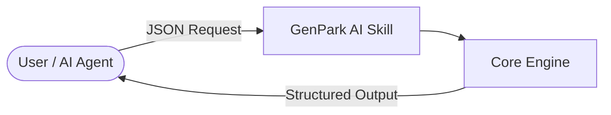

# genpark-ayurvedic-holistic-wellness-personalized-nutrition-skill

   

> **GenPark AI Agent Skill** -- Ayurvedic holistic wellness dosha profiler and personalized plant nutrition (Kapiva style)

## Quick Start
```python
python example_usage.py
```

## Architecture


## MCP
```bash
python mcp_server.py
```
